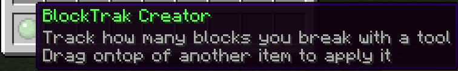

# 💰 Precios

### Precios para Naciones

* **Crear un País/Nación**: $9.000
* **Cambiar Nombre**: $20.000
* **Neutral durante la Guerra**: $20.000
* **Mantenimiento Diario:** $200 \* Qty Chunks (se suma el total de chunks de todas las ciudades de la nación).

#### Precios para Expandir

_La nación no puede claimear chunks, eso es exclusivo de las ciudades. La Nación te permite acceder a claims de chunks bonus para tu ciudad y principalmente domina el territorio de forma Política._

### <mark style="color:red;">La Nación se</mark> <mark style="color:red;"></mark><mark style="color:red;">**borra**</mark> <mark style="color:red;"></mark><mark style="color:red;">si no tiene fondos</mark>

**Cuando una Nación no puede pagar el costo de mantenimiento diario se borra sin previo aviso! no cae en bancarrota como la town sino que directamente se elimina.**

